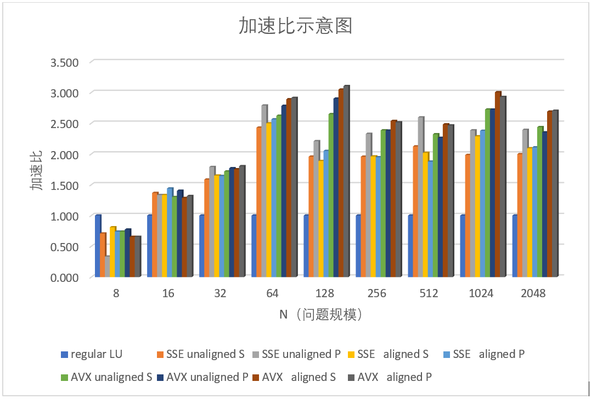

# 使用SIMD优化LU高斯消去法
## 编译运行 
编译器：g++  7.3.0
编译选项：
***
g++ -Wall -fexceptions -g -march=corei7-avx  -c  main.cpp -o main.o
***
利用cpufreq工具将CPU频率锁定在1.6GHz。
选用8、16、32、64、128、256、512、1024、2048作为矩阵的行列数，随机生成矩阵内各元素的值。运用不同的算法记录运算时间，对于每一特定矩阵大小每种算法计算五次取平均运算时间。
## LU高斯消去法
原始的LU高斯消去法如图所示：

## SSE和AVX
SSE和AVX是Intel在CPU中引入的指令集，可以允许CPU进行向量运算。  
SSE算法和AVX算法都是将矩阵中的部分元素向量化，存入128bit（SSE）或256bit（AVX）寄存器当中，之后进行向量运算。
如图所示，在LU算法当中用红色矩形框出的3个运算是可以向量化的：

在这三处，当循环中运算的的元素个数多于4个（SSE）或8个（AVX）时，我们将其存入向量寄存器进行向量化运算，不足4个或8个的，使用平凡的算法运算。

## 考虑对齐问题
SSE和AVX当中有对应的指令load和loadu。load代表作为参数的指针指向的内存地址必须能被16（SSE）或32（AVX）整除；而loadu则没有这样的要求。
若内存是对齐的，则只需要访问内存一次即可将数据装载入向量寄存器；而若内存不对齐则需要做两次相邻的对齐读操作，然后进行合并。

上图屎黄色部分是内存不对齐的数据。
### 开辟内存空间时保证对齐
``` cpp
Matrix[i][j] = (float*)_mm_malloc(sizeof(float)*N, 16); // SSE
Matrix[i][j] = (float*)_mm_malloc(sizeof(float)*N, 32); // AVX
```
### 计算内存对齐位置
``` cpp
// SSE
long matrix_start_addr = (long)(&Matrix[k][0]);
int offset = (matrix_start_addr%16)/4;
int k1 = k - (k+offset)%4 +4;
int n1 = N - (N+offset)%4;
```
## 实验结果

其中p代表着lu算法中第4、5两行的代码进行了向量化  
s代表着。。。。未进行向量化